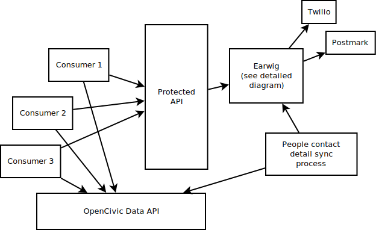

External Documentation
======================

A core part of Earwig is the internally facing Earwig API. This API is not
linked to the rest of the Sunlight API's API key system, rather, it has a 
local list of API keys. This serves to allow us to better control which
consumers may use the service, in order to prevent abuse of the system, and
cause tension or issues between us and the vendors we use to send constituent
mails.

.. _api-docs:

API docs
--------

The API is comprised of a handful of endpoints to control message handoff
to the queue. Each endpoint requires a valid Earwig API key, which are created
manually via the Django admin.

``/sender`` endpoint
++++++++++++++++++++

The ``/sender`` endpoint takes three ``POST`` fields, ``email``,
``name``, and ``ttl``. ``email`` and ``name`` are pretty straightforward,
but ``ttl`` is required to set how long we maintain this data before we
may clear their personal information from our system. We maintain their
ID as a hash of the email, which allows us allow re-creation of accounts
and continue to link to their past sent messages.

.. code-block:: sh

    curl -d "email=whomever@example.com" \
         -d "name=Joe Bleu" \
         -d "ttl=10" \
         https://fancy-host.somewhere.example.com/sender/

Example response:

.. code-block:: json

    {"email": "whomever@example.com",
     "created_at": "2014-04-22T21:59:55.895070+00:00",
     "email_expires_at": "2014-05-02T21:59:55.893558+00:00",
     "name": "Joe Bleu",
     "id": "537086c371f1f81016240873e07147c468001c64a61fd76f1279387bcd62c688"}

``/message`` endpoint
+++++++++++++++++++++

The ``/message`` endpoint is the endpoint most applications will hit, it
simply takes a message to be sent, stores it, and returns the newly minted
Message object. This endpoint requires quite a few params, but will generally
do the right thing. Creating a sender using the ``/sender`` endpoint before
sending the message, as the ``/message`` endpoint will create the sender
if given the correct params.

``/message`` requires ``type``, ``subject``, ``message`` and ``sender``.
``type`` is the Message type, ``public``, ``private`` or ``removed``.
``subject`` is the subject of the message to be sent, and ``message`` is the
body of the mail.

The ``sender`` attribute is a special case, where you may either pass in
an already-created sender ID (from the ``sender.id`` object), or the payload
that would be sent to ``/sender`` anyway in JSON format.

.. code-block:: sh

    curl -d "subject=testing" \
         -d "type=private" \
         -d "message=Hello,%20World" \
         -d "recipients=ocd-person/paultag" \
         -d 'sender={"email": "j@t.com", "name": "j", "ttl": 4}' \
         https://fancy-host.somewhere.example.com/message/

Example response:

.. code-block:: json

    {"message": "Hello, World",
     "id": "952b3d7d95ec41549b777a4336dee701",
     "type": "private",
     "sender": "7ff654d0e56d32cacc46f02e7b67a2f7b00feee128356dbe3c53407fe100695a",
     "recipients": [
        {"status": "unscheduled",
         "recipient_id": 13}
     ],
     "subject": "testing"}

``/message/`` endpoint
++++++++++++++++++++++

The ``/message/<mid>`` endpoint will give you information on the status of the
message sent by it's Message ID. This endpoint takes no params.

.. code-block:: sh

    curl https://fancy-host.somewhere.example.com/message/574d4c144ae042c095aaf67232dfe49b/

Example response:

.. code-block:: json

    {"sender": "7ff654d0e56d32cacc46f02e7b67a2f7b00feee128356dbe3c53407fe100695a",
     "recipients": [
        {"status": "pending", "recipient_id": 13}
    ],
    "message": "Hello, World",
    "type": "private",
    "id": "952b3d7d95ec41549b777a4336dee701",
    "subject": "testing"}

