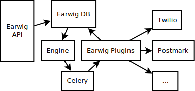

Internals Documentation
=======================

This section covers the internals of how Earwig processes a message
in the Database until it's dispatch to an external service to send the
messages.

Overview
--------

Earwig API
----------

For information on the API, please see the :ref:`api-docs`. Since the API is
the external part of Earwig, it's documented in the Externals documentation.

Earwig engine
-------------

The Earwig engine is the core part of Earwig. The engine is how Earwig
decides which methods to use to get in touch with a legislator, and schedules
the attempts to contact the legislator in the Celery queue.

Engines search for Messages that need to be set which haven't been recieved
by their intended recipient yet. The engine decides on how to batch together
messages to be sent, batches them together in a ``DeliveryAttempt``, and
dispatches a Celery job.

Celery Tasks
------------

The Celery tasks are simple queue processors that actually preform the
hard work of dispatching messages to third party providers, such as
Twilio or Postmark by invoking the plugins requested.

Task ``create_delivery_attempts``
+++++++++++++++++++++++++++++++++

``create_delivery_attempts`` batches up all outstanding ``MessageRecipient``
objects, and passes them off to the current Engine. The Engine will, in turn,
write out ``DeliveryAttempt`` objects.

Task ``process_delivery_attempt``
+++++++++++++++++++++++++++++++++

``process_delivery_attempt`` takes outstanding ``DeliveryAttempt`` objects,
and dispatches (based on type) to registered plugins (in
``engine.core.app.conf.EARWIG_PLUGINS``). 

Earwig Plugins
--------------

The Plugin API was designed to be as minimal as we could make it, allowing
Plugins maximum flexibility in attempting delivery to a remote service,
meaning that the Earwing internals expect very little, and you're forced to
only write what you need to write.

Basically, all Plugins are shipped as Django apps, so that Plugins can provide
their own models for storing local state or records, allowing new attempt
behavior to be driven by past behavior (none of the current plugins use this,
but it's something that was allowed by design).

In addition to the standard Django files, Earwig plugins also ship an
``earwig.py`` module, which contains the Earwig plugin class. The plugin
class (which usually inherit from ``BasePlugin``). Plugins just have to provide
a single method

.. code-block:: python

    def send_message(self, attempt):

which takes in a ``DeliveryAttempt``, attempts delivery via external services
like Twilio or Postmark.

.. code-block:: python

    class ExampleContact(BasePlugin):
        def send_message(self, attempt, debug=False):
            # Invoke the remote API, save any models we need.
            ...
            attempt.mark_attempted(
                DeliveryStatus.sent, 'example', attempt.template
            )
            attempt.save()

Be sure to invoke ``attempt.mark_attempted``, so that the engine doesn't
continue to attempt to dispatch the message to the plugin.
